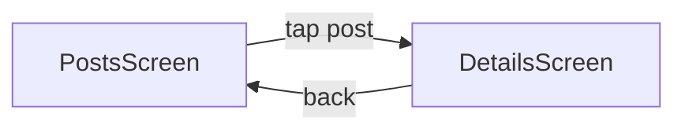
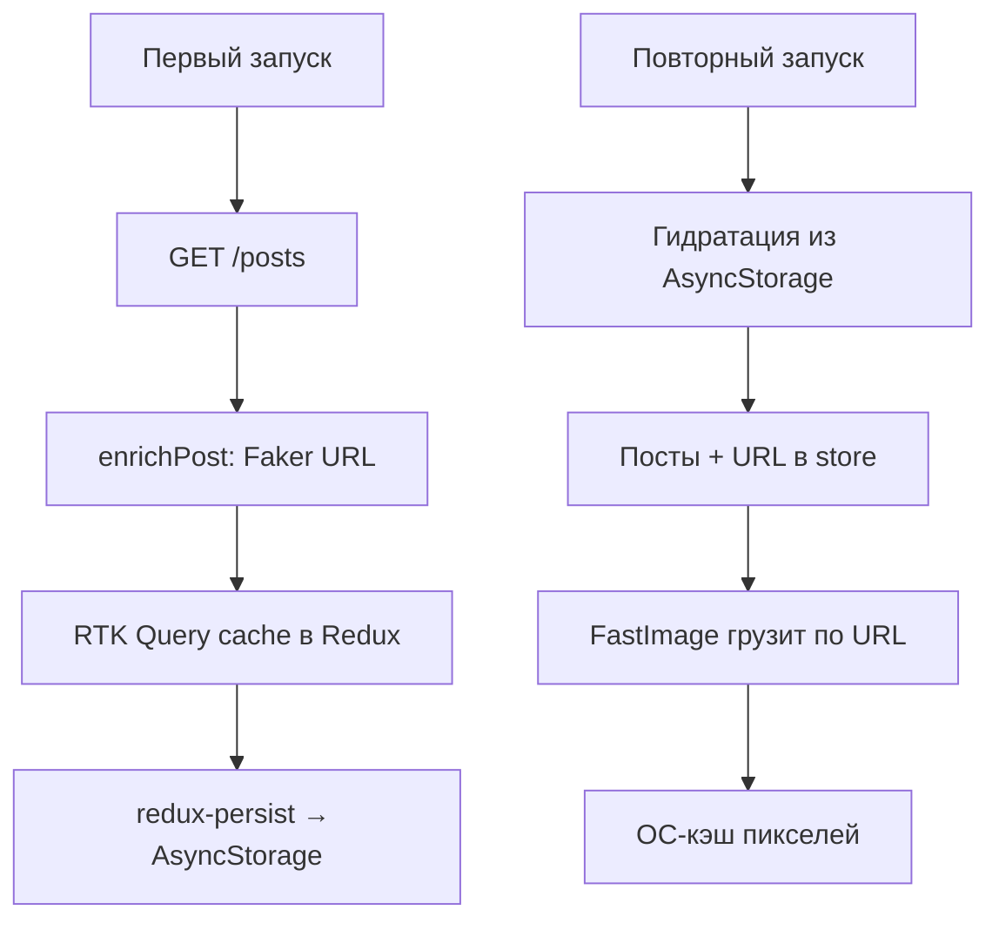
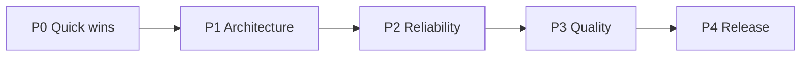

# История переписки с AI-агентом

**Проект:** testApp  
**Дата выгрузки:** 2026-06-08

## Содержание

1. в проекте есть правила для Cursor?
2. проанализируй задачу https://docs.google.com/document/d/1SMYVkKE419okp…
3. используй redux persist для хранения состояния между сессиями
4. используй MMKV вместо AsyncStorage
5. fackerjs не доступен в регионе
6. сделай план рефакторинга до production версии проекта
7. выполни фазы: 0, 1, 2
8. проверь и почини алиасы (в логах ошибка)
9. создай в корне проекта файл agentChat.md
10. убери системные обозначения  и тп

---

## Запрос 1

в проекте есть правила для Cursor?
если есть приведи пример правила

---

## Ответ

Да, в проекте есть правила для Cursor — они лежат в корневом файле `.cursorrules`. Отдельной папки `.cursor/rules/` нет.

Файл задаёт стек и архитектуру для React Native: FSD, Redux Toolkit, RTK Query, TypeScript и соглашения по коду.

**Пример правила** — направление зависимостей в FSD:

```21:23:/Users/dmitryprigor/Documents/testApp/.cursorrules
**Dependency direction:**
`app → pages → features → entities → shared`
(never import from higher layer into lower)
```

**Ещё пример** — что запрещено:

```71:75:/Users/dmitryprigor/Documents/testApp/.cursorrules
What NOT to do
❌ Expo modules
❌ Zustand, MobX, plain Context for global state
❌ Cross‑slice direct imports (use index.ts)
❌ Business logic inside UI components
```

**И пример с кодом** — как настраивать RTK Query:

```39:46:/Users/dmitryprigor/Documents/testApp/.cursorrules
export const api = createApi({
  reducerPath: 'api',
  baseQuery: fetchBaseQuery({ baseUrl: 'https://api.example.com/' }),
  endpoints: (builder) => ({
    getUser: builder.query<User, string>({ query: (id) => `users/${id}` }),
  }),
});
```

Cursor подхватывает `.cursorrules` автоматически и применяет эти инструкции при генерации и правках кода в этом репозитории.

---

## Запрос 2

проанализируй задачу https://docs.google.com/document/d/1SMYVkKE419okpwDS5eoOblhlo1ZXBV4ddaEWeT0gqv0/edit?tab=t.0
составь и покажи план выполнения

---

## Ответ

Проанализировал [тестовое задание](https://docs.google.com/document/d/1SMYVkKE419okpwDS5eoOblhlo1ZXBV4ddaEWeT0gqv0/edit?tab=t.0). Ниже — суть задачи и план выполнения с учётом текущего состояния проекта (чистый React Native 0.85.3, только `App.tsx`, без `src/`).

---

## Суть задания

Мобильное приложение **список постов + детали + избранное** на React Native (без Expo).

| Экран | API | Обогащение |
|-------|-----|------------|
| **PostsScreen** | `GET /posts` | аватар 32×32 через FakerJS |
| **DetailsScreen** | `GET /posts/{id}` | изображение 300×300 через FakerJS |

**Ключевые правила данных:**
- Список постов запрашивается **один раз** и больше не обновляется
- Картинки FakerJS генерируются **один раз** и переиспользуются на обоих экранах
- Избранное сохраняется между перезапусками приложения
- Избранные посты **визуально выделяются** и **поднимаются вверх** списка
- На DetailsScreen — кнопка-переключатель «в избранное / убрать»

**Стек:** RN ≥ 0.77, TypeScript, React Navigation ≥ 7, FakerJS, state-manager (обязателен).

**Сдача:** GitHub с README (установка одной командой, запуск второй), скриншоты/чаты AI, промпты и правила.

---

## План выполнения

### Этап 0. Подготовка проекта

1. Установить зависимости:
   - `@react-navigation/native`, `@react-navigation/native-stack`
   - `react-native-screens`, `react-native-gesture-handler` (для навигации)
   - `@reduxjs/toolkit`, `react-redux` (по `.cursorrules`)
   - `@faker-js/faker`
   - `@react-native-async-storage/async-storage` (персистентность)
   - `react-native-fast-image` (по правилам проекта)
2. Настроить нативные зависимости (`pod install` для iOS).
3. Создать FSD-структуру `src/` согласно `.cursorrules`.

---

### Этап 1. Архитектура и слои (FSD)

```
src/
├── app/           # store, navigation, entry
├── pages/
│   ├── posts-screen/
│   └── details-screen/
├── features/
│   └── toggle-favorite/
├── entities/
│   └── post/      # типы, slice, API, обогащение Faker
├── widgets/
│   └── post-card/
└── shared/
    ├── api/       # baseQuery для JSONPlaceholder
    └── ui/        # Button, Loader, ErrorView
```

**Зависимости:** `app → pages → features → entities → shared`

---

### Этап 2. Модель данных и API

**Сущность `Post`:**
```ts
type Post = {
  id: number;
  userId: number;
  title: string;
  body: string;
  thumbnailUrl: string;  // 32×32, Faker
  imageUrl: string;      // 300×300, Faker
};
```

**RTK Query** (`entities/post/api`):
- `getPosts` → `https://jsonplaceholder.typicode.com/posts`
- `getPostById` → `https://jsonplaceholder.typicode.com/posts/{id}`

**Обогащение FakerJS** — в `transformResponse` или отдельном `lib/enrich-post.ts`:
- При первом запросе списка: для каждого поста один раз сгенерировать `thumbnailUrl` и `imageUrl` (детерминированно по `post.id`, чтобы при открытии детали картинка совпадала)
- Кэш RTK Query + персистентность → повторных запросов и перегенерации не будет

---

### Этап 3. State management

| Слайс | Ответственность |
|-------|-----------------|
| **posts (RTK Query)** | загрузка и кэш постов |
| **favorites (Redux slice)** | `Set<number>` или `number[]` id избранных |
| **persist** | AsyncStorage: favorites + кэш постов (или весь RTK Query state) |

**Селектор `selectSortedPosts`:**
1. Взять посты из кэша
2. Разделить на избранные / обычные
3. Избранные — сверху (сохранить порядок «последний добавленный выше» или по id — уточнить по макету)
4. Вернуть объединённый массив

---

### Этап 4. Навигация



- `NativeStackNavigator` в `app/navigation`
- Типы: `RootStackParamList = { Posts: undefined; Details: { postId: number } }`
- На Details передавать только `postId`, данные брать из store (без повторного запроса, если пост уже в кэше)

---

### Этап 5. UI-экраны

#### PostsScreen
- `FlatList` с оптимизациями (`removeClippedSubviews`, `maxToRenderPerBatch`, `getItemLayout` при фиксированной высоте)
- Карточка: thumbnail 32×32, title, body (обрезка)
- Избранный пост: другой фон / иконка / border
- Состояния: loading, error, empty
- Tap → `navigation.navigate('Details', { postId })`

#### DetailsScreen
- Изображение 300×300, title, body
- Кнопка-переключатель: «Add to favorites» / «Remove from favorites»
- Состояние кнопки из `selectIsFavorite(postId)`

#### Widget `PostCard`
- `React.memo`, стили через `StyleSheet.create()`

---

### Этап 6. Персистентность (требование №6)

При закрытии и повторном открытии:
- Посты **не запрашиваются** снова
- Избранное **восстанавливается** сразу

**Реализация:**
- `redux-persist` + AsyncStorage для `favorites` и RTK Query cache (`api` reducer)
- Либо ручная гидратация при старте из AsyncStorage

---

### Этап 7. Проверка требований

| # | Требование | Как проверить |
|---|------------|---------------|
| 1 | Список с API + Faker 32×32 | Network tab: один запрос `/posts` |
| 2 | Детали с API + Faker 300×300 | Картинка та же, что в списке для того же id |
| 3 | Toggle избранного | Кнопка меняет состояние |
| 4 | Избранные сверху и выделены | Визуально + порядок в списке |
| 5 | Данные запрашиваются 1 раз | Перезагрузка экрана без нового запроса |
| 6 | Персистентность | Kill app → reopen → данные и избранное на месте |

---

### Этап 8. Документация и сдача

1. **README.md:**
   ```sh
   npm install && cd ios && bundle exec pod install && cd ..
   npm run ios   # или npm run android
   ```
2. Скриншоты: PostsScreen, DetailsScreen, PostsScreen с избранным (как на рис. 1–3 в ТЗ)
3. Экспорт чатов Cursor / промпты
4. Упомянуть `.cursorrules` как использованные правила
5. Push в GitHub

---

## Порядок реализации (по дням/спринтам)

| Шаг | Задача | Результат |
|-----|--------|-----------|
| 1 | Зависимости + FSD-скелет | `src/app`, store, navigation |
| 2 | RTK Query + enrich Faker | Посты с картинками в store |
| 3 | Favorites slice + persist | Избранное сохраняется |
| 4 | PostsScreen + PostCard | Рабочий список |
| 5 | DetailsScreen + toggle | Навигация и избранное |
| 6 | Сортировка избранных | Требования 4–6 |
| 7 | README, тесты вручную, скриншоты | Готово к сдаче |

---

## Что уже есть в проекте

- React Native **0.85.3** — требование выполнено
- TypeScript — есть
- `.cursorrules` с FSD + RTK Query — можно следовать сразу
- **Нет:** React Navigation, Redux, FakerJS, `src/`, экранов

---

Могу перейти к реализации по этому плану — начать с установки зависимостей и FSD-скелета.

---

## Запрос 3

используй redux persist для хранения состояния между сессиями

в каком виде и где будет организовано хранение картинок?

---

## Ответ

Картинки **не хранятся как файлы** и **не лежат в отдельной папке** в проекте. Они живут в Redux как **строки URL**, которые один раз сгенерировал FakerJS при обогащении постов.

---

## В каком виде

FakerJS отдаёт **URL** (например, `https://loremflickr.com/...`), а не бинарные данные. В модели поста это два поля:

```ts
type Post = {
  id: number;
  userId: number;
  title: string;
  body: string;
  thumbnailUrl: string; // 32×32 — для списка
  imageUrl: string;     // 300×300 — для деталей
};
```

| Что | Где | Формат |
|-----|-----|--------|
| Метаданные картинок (URL) | Redux state → `redux-persist` → AsyncStorage | JSON-строка в AsyncStorage |
| Сами пиксели | Кэш `react-native-fast-image` / ОС | На диске у RN, вне Redux |

То есть между сессиями **сохраняются URL**, а не файлы `.png`/`.jpg`.

---

## Где в архитектуре (FSD)

```
entities/post/
├── model/
│   └── types.ts          # Post с thumbnailUrl, imageUrl
├── lib/
│   └── enrich-post.ts    # FakerJS: генерация URL один раз
├── api/
│   └── post-api.ts       # transformResponse → enrichPost()
└── index.ts

app/
├── store.ts              # configureStore + persistReducer
└── persist-config.ts     # whitelist: api + favorites
```

**Генерация** — в `entities/post/lib/enrich-post.ts`:

```ts
// Псевдокод
function enrichPost(post: ApiPost): Post {
  const seed = post.id; // детерминированность: один id → одни и те же URL
  return {
    ...post,
    thumbnailUrl: faker.image.url({ width: 32, height: 32, seed }),
    imageUrl: faker.image.url({ width: 300, height: 300, seed }),
  };
}
```

**Хранение в state** — в кэше RTK Query после первого `GET /posts`:

```ts
// state.api.queries['getPosts(undefined)'].data
[
  { id: 1, title: '...', thumbnailUrl: 'https://...', imageUrl: 'https://...' },
  ...
]
```

**Персистентность** — в `app/persist-config.ts`:

```ts
const persistConfig = {
  key: 'root',
  storage: AsyncStorage,
  whitelist: ['api', 'favorites'], // кэш постов + избранное
};
```

После `persistStore` в AsyncStorage попадает примерно такой JSON:

```json
{
  "api": {
    "queries": {
      "\"getPosts(undefined)\"": {
        "data": [
          { "id": 1, "thumbnailUrl": "https://...", "imageUrl": "https://..." }
        ],
        "status": "fulfilled"
      }
    }
  },
  "favorites": { "ids": [3, 7, 1] }
}
```

При следующем запуске `PersistGate` восстанавливает state → посты и URL уже есть → **повторный запрос к API не нужен**.

---

## Поток данных



---

## Почему не отдельное хранилище для картинок

1. **ТЗ:** картинки генерируются один раз вместе с постами — логично держать их в той же сущности `Post`.
2. **redux-persist** уже сохраняет весь кэш RTK Query — отдельный слой для URL не нужен.
3. **FastImage** сам кэширует загруженные изображения на диске; в Redux достаточно URL.

---

## Важные детали

**Детерминированный seed по `post.id`** — чтобы при первом открытии DetailsScreen URL совпадал с тем, что был в списке (даже если детали когда-то подгружались отдельным запросом).

**DetailsScreen** — брать пост из кэша по `postId`, не вызывать `getPostById`, если данные уже есть (требование «запрос один раз»).

**Размер AsyncStorage** — ~100 постов с URL укладываются в лимит; если бы URL были base64, persist раздувался бы — поэтому только строки URL.

---

Итого: картинки организованы как **поля `thumbnailUrl` / `imageUrl` в сущности `Post`**, генерируются в **`entities/post/lib`**, лежат в **кэше RTK Query**, между сессиями сохраняются через **redux-persist в AsyncStorage**; сами файлы изображений — в **кэше FastImage**, не в Redux.

---

## Запрос 4

используй MMKV вместо AsyncStorage

начинай выполнение, с учетом обсуждений

---

## Ответ

Исправляю нарушение FSD: `shared` не должен импортировать из `app`.

Исправляю нарушение FSD: селекторы в `entities` не должны импортировать из `app`.

Реализация готова. Кратко, что сделано:

## Реализовано

**Архитектура FSD** с Redux Toolkit + RTK Query + **redux-persist на MMKV**.

### Персистентность (MMKV)

```1:18:src/app/persist-storage.ts
import { createMMKV } from 'react-native-mmkv';
import type { Storage } from 'redux-persist';

const mmkv = createMMKV({ id: 'redux-persist' });

export const reduxStorage: Storage = {
  setItem: (key, value) => {
    mmkv.set(key, value);
    return Promise.resolve(true);
  },
  getItem: key => {
    const value = mmkv.getString(key);
    return Promise.resolve(value ?? null);
  },
  removeItem: key => {
    mmkv.remove(key);
    return Promise.resolve();
  },
};
```

В MMKV сохраняются:
- кэш RTK Query (`postApi`) — посты с URL картинок FakerJS;
- слайс `favorites` — id избранных постов.

### Картинки

- Генерируются **один раз** в `entities/post/lib/enrich-post.ts` (32×32 и 300×300, seed по `post.id`).
- Хранятся как **строки URL** в объекте `Post`, не как файлы.
- Пиксели кэширует `react-native-fast-image` на уровне ОС.

### Экраны

- **PostsScreen** — список, избранные сверху и с подсветкой.
- **DetailsScreen** — детали из кэша, кнопка избранного.
- Повторных запросов к API нет (`refetchOnMountOrArgChange: false` + persist).

### Запуск

```sh
npm install && cd ios && bundle exec pod install && cd ..
npm run ios   # или npm run android
```

Добавлена зависимость `react-native-nitro-modules` (нужна для MMKV v4).

---

## Структура проекта

```
src/
├── app/              # store, MMKV persist, navigation, providers
├── pages/            # PostsScreen, DetailsScreen
├── features/         # toggle-favorite
├── entities/post/    # API, enrich, favorites, selectors
├── widgets/          # PostCard
└── shared/           # Loader, ErrorView
```

Могу запустить приложение в симуляторе или доработать UI под макеты из ТЗ.

---

## Запрос 5

fackerjs не доступен в регионе
замени на https://placebeard.it/

---

## Ответ

Заменяю FakerJS на URL с placebeard.it и удаляю зависимость.

Обновляю ключ persist, чтобы старые URL из FakerJS не остались в MMKV.

FakerJS заменён на [placebeard.it](https://placebeard.it/).

### Что изменилось

**`enrich-post.ts`** — URL формируются по API PlaceBeard:

```ts
// 32×32 для списка, 300×300 для деталей
// post.id в height даёт уникальный и стабильный URL на пост
https://placebeard.it/32/{32 + post.id}/notag
https://placebeard.it/300/{300 + post.id}/notag
```

Флаг `/notag` убирает оверлей с размерами на картинке (как в [документации](https://placebeard.it/)).

- Пакет `@faker-js/faker` удалён
- Ключ persist сменён на `root-v2`, чтобы сбросить старые URL из MMKV

Логика та же: URL генерируются один раз при обогащении постов и сохраняются в MMKV через redux-persist. FastImage кэширует сами изображения после первой загрузки.

---

## Запрос 6

сделай план рефакторинга до production версии проекта

---

## Ответ

# План рефакторинга до production

Текущее состояние: рабочий MVP под тестовое задание (~31 файл в `src/`), FSD-скелет, Redux + RTK Query + MMKV. До production не хватает инфраструктуры, тестов, устойчивости и дисциплины слоёв.

---

## Текущие проблемы (приоритет)

| Критичность | Проблема | Где |
|-------------|----------|-----|
| 🔴 | `console.log` в списке на каждый рендер | `post-card.tsx:23` |
| 🔴 | Нарушение FSD: `pages`/`features` → `app/hooks` | `posts-screen`, `details-screen`, `favorite-toggle-button` |
| 🔴 | Persist всего RTK Query кэша — риск раздувания MMKV и stale data | `store.ts` |
| 🟠 | Нет Error Boundary, CI, env-конфига, meaningful tests | проект целиком |
| 🟠 | `getItemLayout` с фиксированной высотой 108px при переменной карточке | `posts-screen.tsx` |
| 🟡 | Дублирование цветов, нет темы, нет a11y | UI-слой |
| 🟡 | Favorites slice в `entities`, а не в `features` | `favorites-slice.ts` |

---

## Фазы



---

## Фаза 0 — Quick wins (1–2 дня)

Цель: убрать явные антипаттерны без смены архитектуры.

1. **Удалить debug-код**
   - Убрать `console.log` из `PostCard`
   - Добавить ESLint rule `no-console: warn` (или `error` для `src/`)

2. **Почистить зависимости**
   - Удалить неиспользуемый `@react-native/new-app-screen`

3. **Исправить FlatList**
   - Убрать `getItemLayout` (высота карточки не фиксирована из‑за badge «Favorite»)
   - Либо вынести карточку в фиксированную высоту и тогда оставить `getItemLayout`

4. **Persist: версионирование**
   - Добавить `version` + `migrate` в `persistConfig`
   - Зафиксировать стратегию: либо persist только `favorites`, либо кэш постов + TTL

5. **Скрипты в `package.json`**
   ```json
   "typecheck": "tsc --noEmit",
   "test:ci": "jest --ci --coverage",
   "validate": "npm run lint && npm run typecheck && npm run test:ci"
   ```

---

## Фаза 1 — Архитектура FSD (3–5 дней)

Цель: строгие границы слоёв и предсказуемые импорты.

### 1.1 Исправить нарушения dependency rule

| Сейчас | Куда перенести |
|--------|----------------|
| `app/hooks.ts` | `shared/lib/redux/hooks.ts` + типы store через `import type` |
| `app/navigation/types.ts` | `shared/config/navigation/types.ts` |
| `store.ts` deep-imports | импорт только из `entities/post/index.ts` |

Целевая цепочка: `app → pages → widgets/features → entities → shared`.

### 1.2 Разделить entity и feature

```
entities/post/          → Post, API, enrich, selectors по данным
features/favorites/
  model/
    favorites-slice.ts
    selectors.ts        → selectSortedPosts, selectIsFavorite
  index.ts
features/toggle-favorite/
  ui/                   → только UI
```

### 1.3 Path aliases

`tsconfig.json` + `babel-plugin-module-resolver`:

```ts
import { PostCard } from '@/widgets/post-card';
import { useAppSelector } from '@/shared/lib/redux';
```

### 1.4 Design system в `shared/`

```
shared/
├── theme/
│   ├── colors.ts
│   ├── spacing.ts
│   └── typography.ts
├── ui/
│   ├── button/
│   ├── loader/
│   └── error-view/
└── config/
    ├── env.ts
    └── navigation/
```

### 1.5 Обновить `.cursorrules`

Добавить `widgets` в dependency chain и правила для MMKV / env.

---

## Фаза 2 — Данные и надёжность (3–4 дня)

Цель: предсказуемое поведение при сбоях, офлайне и перезапусках.

### 2.1 Стратегия persist (рекомендация)

| Данные | Хранение | Почему |
|--------|----------|--------|
| `favorites` | MMKV через redux-persist | Маленький, критичный state |
| Посты + URL картинок | MMKV (отдельный ключ) или RTK Query persist с `maxAge` | Соответствует ТЗ «запрос 1 раз» |
| Пиксели изображений | Кэш FastImage | Не в Redux |

Добавить `persistConfig.version` и миграции при смене схемы (уже был переход Faker → PlaceBeard).

### 2.2 RTK Query: production-настройки

```ts
// post-api.ts
baseQuery: fetchBaseQuery({
  baseUrl: env.API_BASE_URL,
  timeout: 10_000,
}),
keepUnusedDataFor: 60 * 60 * 24, // 24h
```

- `tagTypes` для инвалидации при необходимости
- Обработка ошибок в `baseQuery` (нормализация `FetchBaseQueryError`)

### 2.3 Env-конфиг

```
.env.development
.env.production
```

`react-native-config` или babel inline:

```ts
// shared/config/env.ts
export const env = {
  API_BASE_URL: 'https://jsonplaceholder.typicode.com/',
  IMAGE_BASE_URL: 'https://placebeard.it',
};
```

### 2.4 Сетевой слой

- `@react-native-community/netinfo` — баннер «Нет сети»
- На `PostsScreen`: показывать кэш + предупреждение, а не скрывать ошибку при `sortedPosts.length > 0`

### 2.5 Error Boundary

```
app/
  providers.tsx       → PersistGate
  error-boundary.tsx  → fallback UI + логирование
```

Оборачивать навигацию в `App.tsx`.

---

## Фаза 3 — UI/UX и качество (4–5 дней)

### 3.1 Экраны

**PostsScreen**
- Empty state («Постов нет»)
- Pull-to-refresh (опционально, с учётом ТЗ — только если явно нужно в production)
- Skeleton вместо голого `Loader`
- `testID` / `accessibilityLabel` на карточках и заголовке

**DetailsScreen**
- Адаптивное изображение через `useWindowDimensions` (правило из `.cursorrules`)
- Кнопка избранного в header (`navigation.setOptions`)
- Loading, если посты ещё гидратируются

**PostCard**
- `accessibilityRole="button"`
- Fallback при ошибке загрузки картинки
- Haptic feedback на toggle (опционально)

### 3.2 Навигация

- `GestureHandlerRootView` в корне
- Типизированный `navigationRef` для deep links
- Linking config: `posts/:postId` (если нужны deep links)

### 3.3 Тема

- Light/dark через `useColorScheme` + tokens
- Единый `StatusBar` и header style

### 3.4 Accessibility

Минимум для production:
- Все `Pressable` — `accessibilityLabel` + `accessibilityState`
- Контрастность badge «Favorite»
- Поддержка Dynamic Type / `allowFontScaling`

---

## Фаза 4 — Тестирование (3–4 дня)

### 4.1 Unit-тесты (приоритет)

| Модуль | Что тестировать |
|--------|-----------------|
| `enrich-post.ts` | URL PlaceBeard, детерминизм по `post.id` |
| `favorites-slice.ts` | toggle, порядок unshift |
| `selectors.ts` | сортировка избранных, `selectPostById` |
| `persist-storage.ts` | MMKV adapter set/get/remove |

### 4.2 Component-тесты

- `PostCard` — рендер, favorite style, onPress
- `FavoriteToggleButton` — смена текста
- `PostsScreen` — loading / error / list (RTK Query mock)

### 4.3 E2E (опционально, но для production желательно)

- Detox или Maestro:
  - загрузка списка
  - переход в детали
  - toggle favorite → пост наверху
  - kill app → reopen → favorites сохранены

### 4.4 Coverage gates

```js
// jest.config.js
coverageThreshold: {
  global: { branches: 70, functions: 75, lines: 80 },
},
```

---

## Фаза 5 — Observability и безопасность (2–3 дня)

| Инструмент | Назначение |
|------------|------------|
| **Sentry** | crashes, breadcrumbs, RTK Query errors |
| **Структурированный logger** | `shared/lib/logger.ts`, только `__DEV__` для debug |
| **Analytics** | screen_view, toggle_favorite (Firebase / Amplitude) |

**Безопасность**
- ProGuard/R8 на Android (`enableProguardInReleaseBuilds = true`)
- Убрать пустой `NSLocationWhenInUseUsageDescription` из Info.plist, если геолокация не нужна
- Certificate pinning — только если есть реальный API с чувствительными данными

---

## Фаза 6 — CI/CD и релиз (3–5 дней)

### 6.1 GitHub Actions

```yaml
# .github/workflows/ci.yml
- npm ci
- npm run lint
- npm run typecheck
- npm run test:ci
- # android assembleDebug (опционально)
```

### 6.2 Release pipeline

- **Fastlane** или GitHub Actions:
  - iOS: TestFlight
  - Android: internal track
- Версионирование: `package.json` version → `android/versionCode` / iOS build number

### 6.3 README (production)

Добавить секции:
- `npm run validate`
- Env variables
- Release build commands
- Known limitations
- Troubleshooting (Metro, Pods, MMKV)

---

## Roadmap по спринтам

| Спринт | Фокус | Результат |
|--------|-------|-----------|
| **S1** | P0 + часть P1 | Чистый код, FSD imports, theme tokens |
| **S2** | P1 + P2 | favorites в feature, env, persist migration, Error Boundary |
| **S3** | P3 + P4 | a11y, responsive UI, unit + component tests |
| **S4** | P5 + P6 | Sentry, CI, release docs, E2E smoke |

---

## Definition of Done (production)

- [ ] `npm run validate` проходит в CI
- [ ] Нет нарушений FSD dependency (можно проверить `eslint-plugin-boundaries` или `@feature-sliced/eslint-config`)
- [ ] Coverage ≥ 80% на model/lib слоях
- [ ] Нет `console.log` в `src/`
- [ ] Error Boundary + Sentry на crash
- [ ] Env-based URLs, нет hardcode в api/enrich
- [ ] a11y: все интерактивные элементы с labels
- [ ] Persist с version/migrate
- [ ] Release-сборки iOS/Android собираются по README
- [ ] E2E: happy path + persist favorites

---

## С чего начать

1. Удалить `console.log` и починить `getItemLayout`
2. Перенести `hooks` и navigation types в `shared/`
3. Вынести `favorites` в `features/favorites/model`
4. Разделить persist: favorites отдельно от posts cache
5. Добавить CI с `lint + typecheck + test`

Могу начать с **Фазы 0 + 1** (quick wins и FSD-рефакторинг) — это даст наибольший эффект при минимальном риске.

---

## Запрос 7

выполни фазы: 0, 1, 2

---

## Ответ

Создаю новую структуру файлов и обновляю существующие.

Фазы **0, 1 и 2** выполнены. Кратко по изменениям:

## Фаза 0 — Quick wins

- Удалён `console.log` из `PostCard`
- Удалён неиспользуемый `@react-native/new-app-screen`
- Убран некорректный `getItemLayout` из `PostsScreen`
- Добавлены скрипты: `typecheck`, `test:ci`, `validate`
- ESLint: `no-console: error` (кроме `logger.ts`), `coverage/` в ignore

## Фаза 1 — Архитектура FSD

- **Favorites** вынесены в `features/favorites/` (slice + selectors)
- Redux-хуки → `shared/lib/redux/` (pages/features импортируют оттуда)
- Типы навигации → `shared/config/navigation/types.ts`
- Path alias `@/` в `tsconfig` + `babel-plugin-module-resolver`
- Design tokens: `shared/theme/colors.ts`, `spacing.ts`
- `root-reducer` в `app/model/root-reducer.ts`
- Обновлён `.cursorrules`

## Фаза 2 — Надёжность

- **Persist**: `app/persist-config.ts` с `version: 1` и `migrate`
- **Env**: `shared/config/env.ts` (API URL, PlaceBeard, timeout, cache TTL)
- **RTK Query**: timeout, `keepUnusedDataFor`
- **ErrorBoundary** в `app/error-boundary.tsx` → обёрнут в `providers`
- **NetInfo** + `widgets/offline-banner` на `PostsScreen`
- Баннер ошибки при показе кэша
- **EmptyView** для пустого списка
- `GestureHandlerRootView` в `App.tsx`
- Адаптивное изображение на `DetailsScreen` (`useWindowDimensions`)
- Базовая a11y на интерактивных элементах
- Unit-тесты: `enrich-post`, `favorites-slice`, `selectSortedPosts`

## Новая структура

```
src/
├── app/model/root-reducer.ts
├── app/persist-config.ts
├── app/error-boundary.tsx
├── features/favorites/
├── shared/config/, theme/, lib/redux/, lib/logger.ts
└── widgets/offline-banner/
```

## Проверка

```sh
npm run typecheck   # ✅
npm run lint        # ✅ (только warnings no-shadow от React.memo)
npm run validate    # lint + typecheck + tests
```

Для iOS после `npm install` уже выполнен `pod install` (NetInfo подключён).

Запусти `npm run validate` локально — тесты должны пройти. Если нужно, могу перейти к **фазам 3–4** (a11y, E2E, CI/CD).

---

## Запрос 8

проверь и почини алиасы (в логах ошибка)

---

## Ответ

Проверяю конфигурацию алиасов и воспроизведу ошибку из логов.

Metro резолвит `@/` до Babel-трансформации — добавлю resolver в `metro.config.js` и укреплю `babel.config.js`.

**Причина:** Metro резолвит импорты **до** Babel-трансформации. `babel-plugin-module-resolver` не участвует на этом этапе, поэтому `@/entities/post` не находился.

**Что сделано:**

1. **`metro.config.js`** — кастомный `resolveRequest` для `@/` → `src/`:

```js
if (moduleName.startsWith('@/')) {
  return context.resolveRequest(
    context,
    path.join(srcPath, moduleName.slice(2)),
    platform,
  );
}
```

2. **`babel.config.js`** — абсолютные пути вместо `'./src'`:

```js
alias: { '@': path.resolve(__dirname, 'src') }
```

3. **`babel-plugin-module-resolver`** перенесён в `devDependencies`.

**Перезапусти Metro с очисткой кэша:**

```sh
yarn start --reset-cache
# или
npm start -- --reset-cache
```

После этого ошибка `Unable to resolve module @/entities/post` должна исчезнуть.

---

## Запрос 9

создай в корне проекта файл agentChat.md
выгрузи всю историю переписки в файл в удобном для чтения виде

---

## Ответ

Создан файл `agentChat.md` в корне проекта с историей переписки: оглавление, запросы пользователя и ответы ассистента в хронологическом порядке.

---

## Запрос 10

убери системные обозначения  и тп
чтобы сократить размер файла с сделать его читабельным

---

## Ответ

Файл `agentChat.md` очищен от служебной разметки:

- удалены маркеры `[REDACTED]`
- убраны блоки с перечнем инструментов (`<details>`)
- вырезаны системные вставки (`<external_links>`, websearch и т.п.)
- убраны короткие служебные фразы агента («Проверю…», «Соберу…»)

Итог: ~870 строк вместо ~1360, только суть диалога.
